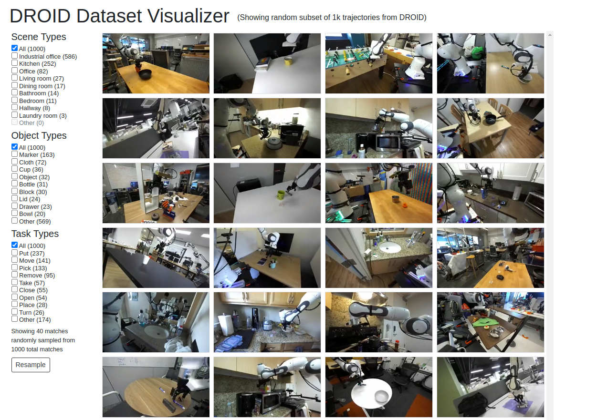

## 🔍 Exploring the Dataset

It is possible to interactively explore the DROID via the following [interactive dataset visualizer](https://www.cs.princeton.edu/~jw60/droid-dataset-visualizer/). This is a great way to start understanding the DROID dataset and is a highly recommended starting point.

<a href="https://www.cs.princeton.edu/~jw60/droid-dataset-visualizer/"></a>

## 📈 Using the Dataset

The DROID dataset is hosted within a Google Cloud Bucket and is offered in two formats:

1. [RLDS](https://github.com/google-research/rlds): ideal for dataloading for the purpose of training policies
2. Raw Data: ideal for those who wish to manipulate the raw data

To browse the bucket storing the data visit the following [link](https://console.cloud.google.com/storage/browser/xembodiment_data/r2d2).

### Accessing RLDS Dataset

To load the RLDS dataset directly as a tensorflow datast one can run the below snippet. It is worth noting that there are a variety of tools that exist for interacting with RLDS formatted datasets, for the below example we demonstrate how to load a small subset of the dataset and view an image.

```python
import tensorflow_datasets as tfds
from PIL import Image

# get the dataset
data_directory = 'gs://xembodiment_data/r2d2/tfds/2024_01_23/1.0.0'
dataset_builder = tfds.builder_from_directory(data_directory)

# inspect episode data
dataset_sample = dataset_builder.as_dataset(split='train[:10]').shuffle(10) # 10 episode from train split
episode = next(iter(dataset_sample))

# lets look at the exterior left image
images = [step['observation']['exterior_image_1_left'] for step in episode['steps']]
images = [Image.fromarray(image.numpy()) for image in images]
images[0].show()
```

For more complex examples of loading the RLDS format of the DROID and for training policies please consult the [policy learning repository]().

### Accessing Raw Data

The easiest way to download the raw dataset is via `gsutil`, to get started please install the gcloud CLI tools at the following [link](https://cloud.google.com/sdk/docs/install).

With `gsutil` installed it is now possible to copy the raw data with the below command:

```bash
gsutil cp -r gs://xembodiment_data/r2d2/r2d2-data-full <path_on_local>
```

## 📝 Dataset Schema

```json
{
    "pythonClassName": "tensorflow_datasets.core.features.features_dict.FeaturesDict",
    "featuresDict": {
        "features": {
            "steps": {
                "pythonClassName": "tensorflow_datasets.core.features.dataset_feature.Dataset",
                "sequence": {
                    "feature": {
                        "pythonClassName": "tensorflow_datasets.core.features.features_dict.FeaturesDict",
                        "featuresDict": {
                            "features": {
                                "is_terminal": {
                                    "pythonClassName": "tensorflow_datasets.core.features.scalar.Scalar",
                                    "tensor": {
                                        "shape": {},
                                        "dtype": "bool",
                                        "encoding": "none"
                                    },
                                    "description": "True on last step of the episode if it is a terminal step, True for demos."
                                },
                                "is_last": {
                                    "pythonClassName": "tensorflow_datasets.core.features.scalar.Scalar",
                                    "tensor": {
                                        "shape": {},
                                        "dtype": "bool",
                                        "encoding": "none"
                                    },
                                    "description": "True on last step of the episode."
                                },
                                "language_instruction_3": {
                                    "pythonClassName": "tensorflow_datasets.core.features.text_feature.Text",
                                    "text": {},
                                    "description": "Alternative Language Instruction."
                                },
                                "observation": {
                                    "pythonClassName": "tensorflow_datasets.core.features.features_dict.FeaturesDict",
                                    "featuresDict": {
                                        "features": {
                                            "gripper_position": {
                                                "pythonClassName": "tensorflow_datasets.core.features.tensor_feature.Tensor",
                                                "tensor": {
                                                    "shape": {
                                                        "dimensions": [
                                                            "1"
                                                        ]
                                                    },
                                                    "dtype": "float64",
                                                    "encoding": "none"
                                                },
                                                "description": "Gripper position statae"
                                            },
                                            "cartesian_position": {
                                                "pythonClassName": "tensorflow_datasets.core.features.tensor_feature.Tensor",
                                                "tensor": {
                                                    "shape": {
                                                        "dimensions": [
                                                            "6"
                                                        ]
                                                    },
                                                    "dtype": "float64",
                                                    "encoding": "none"
                                                },
                                                "description": "Robot Cartesian state"
                                            },
                                            "wrist_image_left": {
                                                "pythonClassName": "tensorflow_datasets.core.features.image_feature.Image",
                                                "image": {
                                                    "shape": {
                                                        "dimensions": [
                                                            "180",
                                                            "320",
                                                            "3"
                                                        ]
                                                    },
                                                    "dtype": "uint8",
                                                    "encodingFormat": "jpeg"
                                                },
                                                "description": "Wrist camera RGB left viewpoint"
                                            },
                                            "joint_position": {
                                                "pythonClassName": "tensorflow_datasets.core.features.tensor_feature.Tensor",
                                                "tensor": {
                                                    "shape": {
                                                        "dimensions": [
                                                            "7"
                                                        ]
                                                    },
                                                    "dtype": "float64",
                                                    "encoding": "none"
                                                },
                                                "description": "Joint position state"
                                            },
                                            "exterior_image_2_left": {
                                                "pythonClassName": "tensorflow_datasets.core.features.image_feature.Image",
                                                "image": {
                                                    "shape": {
                                                        "dimensions": [
                                                            "180",
                                                            "320",
                                                            "3"
                                                        ]
                                                    },
                                                    "dtype": "uint8",
                                                    "encodingFormat": "jpeg"
                                                },
                                                "description": "Exterior camera 2 left viewpoint"
                                            },
                                            "exterior_image_1_left": {
                                                "pythonClassName": "tensorflow_datasets.core.features.image_feature.Image",
                                                "image": {
                                                    "shape": {
                                                        "dimensions": [
                                                            "180",
                                                            "320",
                                                            "3"
                                                        ]
                                                    },
                                                    "dtype": "uint8",
                                                    "encodingFormat": "jpeg"
                                                },
                                                "description": "Exterior camera 1 left viewpoint"
                                            }
                                        }
                                    }
                                },
                                "action_dict": {
                                    "pythonClassName": "tensorflow_datasets.core.features.features_dict.FeaturesDict",
                                    "featuresDict": {
                                        "features": {
                                            "gripper_position": {
                                                "pythonClassName": "tensorflow_datasets.core.features.tensor_feature.Tensor",
                                                "tensor": {
                                                    "shape": {
                                                        "dimensions": [
                                                            "1"
                                                        ]
                                                    },
                                                    "dtype": "float64",
                                                    "encoding": "none"
                                                },
                                                "description": "Commanded gripper position"
                                            },
                                            "cartesian_velocity": {
                                                "pythonClassName": "tensorflow_datasets.core.features.tensor_feature.Tensor",
                                                "tensor": {
                                                    "shape": {
                                                        "dimensions": [
                                                            "6"
                                                        ]
                                                    },
                                                    "dtype": "float64",
                                                    "encoding": "none"
                                                },
                                                "description": "Commanded Cartesian velocity"
                                            },
                                            "cartesian_position": {
                                                "pythonClassName": "tensorflow_datasets.core.features.tensor_feature.Tensor",
                                                "tensor": {
                                                    "shape": {
                                                        "dimensions": [
                                                            "6"
                                                        ]
                                                    },
                                                    "dtype": "float64",
                                                    "encoding": "none"
                                                },
                                                "description": "Commanded Cartesian position"
                                            },
                                            "gripper_velocity": {
                                                "pythonClassName": "tensorflow_datasets.core.features.tensor_feature.Tensor",
                                                "tensor": {
                                                    "shape": {
                                                        "dimensions": [
                                                            "1"
                                                        ]
                                                    },
                                                    "dtype": "float64",
                                                    "encoding": "none"
                                                },
                                                "description": "Commanded gripper velocity"
                                            },
                                            "joint_position": {
                                                "pythonClassName": "tensorflow_datasets.core.features.tensor_feature.Tensor",
                                                "tensor": {
                                                    "shape": {
                                                        "dimensions": [
                                                            "7"
                                                        ]
                                                    },
                                                    "dtype": "float64",
                                                    "encoding": "none"
                                                },
                                                "description": "Commanded joint position"
                                            },
                                            "joint_velocity": {
                                                "pythonClassName": "tensorflow_datasets.core.features.tensor_feature.Tensor",
                                                "tensor": {
                                                    "shape": {
                                                        "dimensions": [
                                                            "7"
                                                        ]
                                                    },
                                                    "dtype": "float64",
                                                    "encoding": "none"
                                                },
                                                "description": "Commanded joint velocity"
                                            }
                                        }
                                    }
                                },
                                "discount": {
                                    "pythonClassName": "tensorflow_datasets.core.features.scalar.Scalar",
                                    "tensor": {
                                        "shape": {},
                                        "dtype": "float32",
                                        "encoding": "none"
                                    },
                                    "description": "Discount if provided, default to 1."
                                },
                                "reward": {
                                    "pythonClassName": "tensorflow_datasets.core.features.scalar.Scalar",
                                    "tensor": {
                                        "shape": {},
                                        "dtype": "float32",
                                        "encoding": "none"
                                    },
                                    "description": "Reward if provided, 1 on final step for demos."
                                },
                                "language_embedding_3": {
                                    "pythonClassName": "tensorflow_datasets.core.features.tensor_feature.Tensor",
                                    "tensor": {
                                        "shape": {
                                            "dimensions": [
                                                "512"
                                            ]
                                        },
                                        "dtype": "float32",
                                        "encoding": "none"
                                    },
                                    "description": "Alternative Kona language embedding."
                                },
                                "language_embedding": {
                                    "pythonClassName": "tensorflow_datasets.core.features.tensor_feature.Tensor",
                                    "tensor": {
                                        "shape": {
                                            "dimensions": [
                                                "512"
                                            ]
                                        },
                                        "dtype": "float32",
                                        "encoding": "none"
                                    },
                                    "description": "Kona language embedding. See https://tfhub.dev/google/universal-sentence-encoder-large/5"
                                },
                                "language_instruction_2": {
                                    "pythonClassName": "tensorflow_datasets.core.features.text_feature.Text",
                                    "text": {},
                                    "description": "Alternative Language Instruction."
                                },
                                "language_instruction": {
                                    "pythonClassName": "tensorflow_datasets.core.features.text_feature.Text",
                                    "text": {},
                                    "description": "Language Instruction."
                                },
                                "is_first": {
                                    "pythonClassName": "tensorflow_datasets.core.features.scalar.Scalar",
                                    "tensor": {
                                        "shape": {},
                                        "dtype": "bool",
                                        "encoding": "none"
                                    },
                                    "description": "True on first step of the episode."
                                },
                                "language_embedding_2": {
                                    "pythonClassName": "tensorflow_datasets.core.features.tensor_feature.Tensor",
                                    "tensor": {
                                        "shape": {
                                            "dimensions": [
                                                "512"
                                            ]
                                        },
                                        "dtype": "float32",
                                        "encoding": "none"
                                    },
                                    "description": "Alternative Kona language embedding."
                                },
                                "action": {
                                    "pythonClassName": "tensorflow_datasets.core.features.tensor_feature.Tensor",
                                    "tensor": {
                                        "shape": {
                                            "dimensions": [
                                                "7"
                                            ]
                                        },
                                        "dtype": "float64",
                                        "encoding": "none"
                                    },
                                    "description": "Robot action, consists of [6x joint velocities,                             1x gripper position]."
                                }
                            }
                        }
                    },
                    "length": "-1"
                }
            },
            "episode_metadata": {
                "pythonClassName": "tensorflow_datasets.core.features.features_dict.FeaturesDict",
                "featuresDict": {
                    "features": {
                        "recording_folderpath": {
                            "pythonClassName": "tensorflow_datasets.core.features.text_feature.Text",
                            "text": {},
                            "description": "Path to the folder of recordings."
                        },
                        "file_path": {
                            "pythonClassName": "tensorflow_datasets.core.features.text_feature.Text",
                            "text": {},
                            "description": "Path to the original data file."
                        }
                    }
                }
            }
        }
    }
}
```

## 📄 Data Analysis and Further Information
Please consult the [paper](https://openreview.net/pdf?id=gG0QQsoaCp) for detailed data analysis and further information about the dataset.
